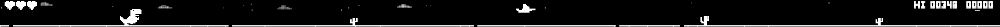
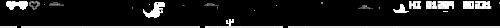
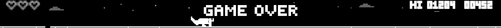

# T-Rex Bar 🦖

**The Chrome dino game — playable on your MacBook's Touch Bar.**



A Chrome-dino-style endless runner that lives on the Touch Bar OLED strip.
Jump cacti, duck pterodactyls, lose hearts, chase your hi-score — all in pure
white-on-black pixel art, rendered natively on the strip above your keyboard.

When you're not playing, the T-Rex plays itself: a little ambient scene with
twinkling stars, drifting clouds, a crescent moon, and the occasional shooting
star.


## Features

- 🎮 **Playable** — arrow keys steer the dino: run, jump, crouch
- ♥♥♥ **Three lives**, shown as pixel hearts on the left of the strip
- 🏆 **Score & hi-score** (remembered between launches), world speeds up as you survive
- 🌙 **Ambient mode** — when you're not playing, the dino runs on autopilot
  through a starry night scene
- 🖥 Tiny native app (~270 KB), no dependencies, menu-bar only (no Dock icon)

| In game | Game over |
| --- | --- |
|  |  |

## Requirements

- A MacBook Pro with a **Touch Bar** (2016–2019, or 13" M1/M2 with Touch Bar)
- macOS 13+
- Xcode Command Line Tools to build (`xcode-select --install`)

## Build & run

```bash
git clone <this repo>
cd TRexBar
./build.sh
open "build/T-Rex Bar.app"
```

The dino appears on your Touch Bar and a small dino icon appears in the menu
bar. (If you downloaded a prebuilt app instead of building it, macOS will warn
about an unidentified developer — right-click the app → **Open** the first
time.)

## How to play

Click the **dino icon** in the menu bar → **Play with Keyboard**.

| Key | Action |
| --- | --- |
| **→** | run forward |
| **←** | run backward |
| **↑** or **Space** | jump — and restart after game over |
| **↓** | crouch (hold to duck under pterodactyls; press mid-air to slam down) |
| **Esc** | leave the game |

You have **three lives** (the hearts at the left of the strip). Hitting a
cactus or a pterodactyl costs one heart — the dino flashes briefly and keeps
running. Lose all three: **GAME OVER** — press **↑** to run again.

### Two ways the keys reach the dino

1. **No permissions needed (default):** the game opens a small floating
   **T-Rex Controller** window. Keep it focused and use the arrows.
2. **Global keys (optional):** grant **Accessibility** permission
   (System Settings → Privacy & Security → Accessibility → T-Rex Bar). The
   moment you allow it, the controller window disappears and the arrows work
   no matter which app is focused. While the game is on, arrows / Space / Esc
   are captured (⌘ ⌥ ⌃ shortcuts pass through); **Esc** gives your keyboard
   back.

> Rebuilt the app yourself and global keys stopped working? Remove T-Rex Bar
> from the Accessibility list and add it again — the ad-hoc code signature
> changes on every build. The controller window always works regardless.

## Menu

Click the dino icon in the menu bar:

- **Play with Keyboard** — start / stop the game
- **Pause / Resume** (you can also tap the Touch Bar strip)
- **Speed** — Chill / Normal / Fast / Insane
- **Touch Bar Dino** — show / hide the dino on the Touch Bar
- **Launch at Login**
- **Relaunch T-Rex Bar** — full reset: quits and reopens the app
- **Quit**

## How it works

The Touch Bar rendering uses the same private `DFRFoundation` API as
[Pock](https://pock.app) and [MTMR](https://github.com/Toxblh/MTMR): the app
presents a system-modal Touch Bar that spans the full strip. Because the API
is private, this app can never be on the Mac App Store, needs a real Touch
Bar Mac, and may break in a future macOS release.

If your Touch Bar is set to "Expanded Control Strip" or "F1, F2, etc. Keys",
the app temporarily switches it to "App Controls with Control Strip" and
restores your original setting when you quit or turn the dino off. Hold **fn**
any time for the classic F-keys. Tap the **✕** at the left edge of the strip
to get your normal Touch Bar back — the dino icon in the Control Strip
brings the game back.

Everything — the game, the sprites, the app icon, even the gameplay GIF above —
is generated by one Swift file: [Sources/main.swift](Sources/main.swift).

## Dev previews

Render the art without touching your Touch Bar:

```bash
BIN="build/T-Rex Bar.app/Contents/MacOS/TRexBar"
"$BIN" --sprites /tmp/sprites     # every sprite as a large PNG
"$BIN" --preview /tmp/preview     # staged scene screenshots
"$BIN" --appicon /tmp/icon        # the 1024px app icon
"$BIN" --gifframes /tmp/frames    # scripted gameplay, one PNG per frame
```
